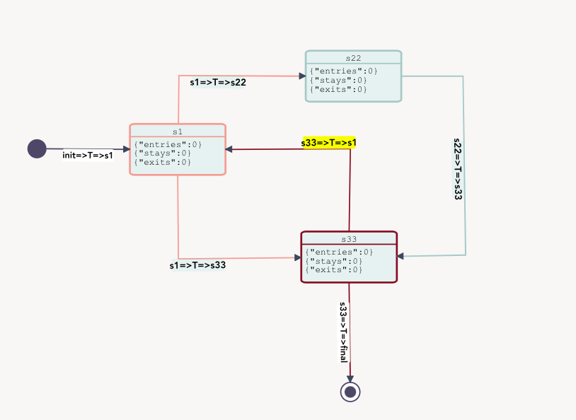

# ASMgraph
## State Diagram Notation (Graph) 

State diagrams (also called State Chart diagrams) are used to help the developer better understand any complex/unusual functionalities or business flows of specialized areas of the system. In short, State diagrams depict the dynamic behavior of the entire system, or a sub-system, or even a single object in a system. This is done with the help of Behavioral elements.

### Finite State Machine (FSM) 

A Finite State Machine (FSM) is the representation of a system in terms of its states and events. A state is simply a decision point at the system level , and an event is a stimulus that causes a state transition within the system. Therefore , a state machine stays in the current state until n event is received causing a state transition. If the state to transition to is the current state, a new state is not entered event though a state transition occurs.

### Mealy and Moore

Two well known types of state machine are the Mealy and Moore machines. The difference between these state machines is their output. The output of the Mealy state machine depends on the received event, while the output of the Moore state machine does not.

The functions defining the Moore state machine at transition t are: 

`S(t+1) = Function (S(t),I(t)); O(t+1) = Function (S(t))`

The functions defining the Mealy state machine at transition t are: 

`S(t+1) = Function (S(t),I(t)); O(t+1) = Function (S(t),I(t))`

While the state transition function S is same for both states machine, the output function O is different. The output of the Moore machine depends solely on the current state, while the output of the Mealy machine depends on both the current state and input.

### Deterministic and Non- Deterministic

In a state transition diagram, if no two outgoing edges of a state have the same label, then the corresponding machine is called a deterministic finite state machine …if two or more outgoing edges of a state have the same label, then it is called a non-deterministic finite state machine.

### Installation

` npm install @vcomm/asmgraph `

### Run

` cd @vcomm/asmgraph `

Start application

` npm start ` 

### Rebuild

` cd @vcomm/asmgraph/widgets/graph `

Change UI and rebuild

` npm run build `



## JSON output format

```
{"id":"tst","type":"FSM","prj":"prj","complete":false,"start":{},"stop":{},"countstates":5,"states":{"init":{"key":"init","name":"init","exits":[],"transitions":[{"key":"init=>T=>s1","nextstatename":"s1","triggers":[],"effects":[],"model":{"type":"uml.Transition","source":{"id":"b3ae509e-b7fa-457d-83c0-c82990c1d284"},"target":{"id":"e1e42b19-5554-4d27-9cf1-ce314a0f0e57"},"labels":[{"position":{"distance":0.5,"offset":10,"args":{"keepGradient":true,"ensureLegibility":true}},"attrs":{"text":{"text":"init=>T=>s1","fontWeight":"bold"}}}],"id":"7779b532-4036-4944-adbb-a94e6ee298c0","z":6,"attrs":{".connection":{"stroke":"#4b4a67","fill":"none","stroke-linejoin":"round","stroke-width":"2"},".marker-arrowheads":{"display":"none"}}}}],"model":{"type":"uml.StartState","size":{"width":30,"height":30},"position":{"x":136,"y":261},"angle":0,"id":"b3ae509e-b7fa-457d-83c0-c82990c1d284","z":1,"attrs":{"circle":{"fill":"#4b4a67","stroke":"none"},"text":{"font-size":15,"fill":"black"},"rect":{"fill":"rgba(48, 208, 198, 0.1)"}}}},"final":{"key":"final","name":"final","entries":[],"model":{"type":"uml.EndState","size":{"width":30,"height":30},"position":{"x":698,"y":619},"angle":0,"id":"a463ea39-03b7-44b9-b2c3-27e1146c721a","z":2,"attrs":{".outer":{"stroke":"#4b4a67","stroke-width":2},".inner":{"fill":"#4b4a67"},"rect":{"fill":"rgba(48, 208, 198, 0.1)"},"text":{"fill":"black","font-size":15}}}},"s1":{"key":"s1","name":"s1","entries":[],"stays":[],"exits":[],"transitions":[{"key":"s1=>T=>s22","nextstatename":"s22","triggers":[],"effects":[],"model":{"type":"uml.Transition","source":{"id":"e1e42b19-5554-4d27-9cf1-ce314a0f0e57"},"target":{"id":"4c1a0bed-cb31-4808-8aee-3035ba37c08c"},"labels":[{"position":{"distance":0.5,"offset":10,"args":{"keepGradient":true,"ensureLegibility":true}},"attrs":{"text":{"text":"s1=>T=>s22","fontWeight":"bold"}}}],"id":"1acdf91a-3675-4216-a5fb-6479d71dccb5","z":7,"attrs":{".connection":{"stroke":"#138B5E","fill":"none","stroke-linejoin":"round","stroke-width":"2"},".marker-arrowheads":{"display":"none"}}}},{"key":"s1=>T=>s33","nextstatename":"s33","triggers":[],"effects":[],"model":{"type":"uml.Transition","source":{"id":"e1e42b19-5554-4d27-9cf1-ce314a0f0e57"},"target":{"id":"7900c31d-7f40-4b55-806c-18b8db2a8c08"},"labels":[{"position":{"distance":0.5,"offset":10,"args":{"keepGradient":true,"ensureLegibility":true}},"attrs":{"text":{"text":"s1=>T=>s33","fontWeight":"bold"}}}],"id":"18b49ca4-45f6-41be-8cd6-0335aec2408f","z":8,"attrs":{".connection":{"stroke":"#138B5E","fill":"none","stroke-linejoin":"round","stroke-width":"2"},".marker-arrowheads":{"display":"none"}}}}],"model":{"type":"uml.State","name":"s1","events":["{\"entries\":0}","{\"stays\":0}","{\"exits\":0}"],"position":{"x":326,"y":238},"size":{"width":150,"height":80},"angle":0,"id":"e1e42b19-5554-4d27-9cf1-ce314a0f0e57","z":3,"attrs":{".uml-state-body":{"fill":"rgba(48, 208, 198, 0.1)","stroke":"#138B5E"},".uml-state-separator":{"stroke":"#138B5E","d":"M 0 20 L 150 20"},".uml-state-name":{"text":"s1"},".uml-state-events":{"text":"{\"entries\":0}\n{\"stays\":0}\n{\"exits\":0}"},"rect":{"fill":"rgba(48, 208, 198, 0.1)"},"text":{"fill":"black","font-size":15}}}},"s22":{"key":"s22","name":"s22","entries":[],"stays":[],"exits":[],"transitions":[{"key":"s22=>T=>s33","nextstatename":"s33","triggers":[],"effects":[],"model":{"type":"uml.Transition","source":{"id":"4c1a0bed-cb31-4808-8aee-3035ba37c08c"},"target":{"id":"7900c31d-7f40-4b55-806c-18b8db2a8c08"},"labels":[{"position":{"distance":0.5,"offset":10,"args":{"keepGradient":true,"ensureLegibility":true}},"attrs":{"text":{"text":"s22=>T=>s33","fontWeight":"bold"}}}],"id":"a513d641-8a1d-456a-8e87-997f7fba8c19","z":11,"vertices":[{"x":926,"y":159},{"x":931,"y":418}],"attrs":{".connection":{"stroke":"#8CDF92","fill":"none","stroke-linejoin":"round","stroke-width":"2"},".marker-arrowheads":{"display":"none"},"rect":{"fill":"rgba(48, 208, 198, 0.1)"},"text":{"fill":"black","font-size":15}}}}],"model":{"type":"uml.State","name":"s22","events":["{\"entries\":0}","{\"stays\":0}","{\"exits\":0}"],"position":{"x":632,"y":111},"size":{"width":150,"height":80},"angle":0,"id":"4c1a0bed-cb31-4808-8aee-3035ba37c08c","z":4,"attrs":{".uml-state-body":{"fill":"rgba(48, 208, 198, 0.1)","stroke":"#8CDF92"},".uml-state-separator":{"stroke":"#8CDF92","d":"M 0 20 L 150 20"},".uml-state-name":{"text":"s22"},".uml-state-events":{"text":"{\"entries\":0}\n{\"stays\":0}\n{\"exits\":0}"},"rect":{"fill":"rgba(48, 208, 198, 0.1)"},"text":{"fill":"black","font-size":15}}}},"s33":{"key":"s33","name":"s33","entries":[],"stays":[],"exits":[],"transitions":[{"key":"s33=>T=>s1","nextstatename":"s1","triggers":[],"effects":[],"model":{"type":"uml.Transition","source":{"id":"7900c31d-7f40-4b55-806c-18b8db2a8c08"},"target":{"id":"e1e42b19-5554-4d27-9cf1-ce314a0f0e57"},"labels":[{"position":{"distance":0.5,"offset":10,"args":{"keepGradient":true,"ensureLegibility":true}},"attrs":{"text":{"text":"s33=>T=>s1","fontWeight":"bold"}}}],"id":"1a5ac375-fc8a-4286-a5fd-7d15b992fd09","z":9,"vertices":[{"x":706,"y":285}],"attrs":{".connection":{"stroke":"#4A981E","fill":"none","stroke-linejoin":"round","stroke-width":"2"},".marker-arrowheads":{"display":"none"},"rect":{"fill":"rgba(48, 208, 198, 0.1)"},"text":{"fill":"black","font-size":15}}}},{"key":"s33=>T=>final","nextstatename":"final","triggers":[],"effects":[],"model":{"type":"uml.Transition","source":{"id":"7900c31d-7f40-4b55-806c-18b8db2a8c08"},"target":{"id":"a463ea39-03b7-44b9-b2c3-27e1146c721a"},"labels":[{"position":{"distance":0.5,"offset":10,"args":{"keepGradient":true,"ensureLegibility":true}},"attrs":{"text":{"text":"s33=>T=>final","fontWeight":"bold"}}}],"id":"7d1d6dd1-9bab-4666-a2a1-0ad6e9ff1e2c","z":10,"attrs":{".connection":{"stroke":"#4A981E","fill":"none","stroke-linejoin":"round","stroke-width":"2"},".marker-arrowheads":{"display":"none"}}}}],"model":{"type":"uml.State","name":"s33","events":["{\"entries\":0}","{\"stays\":0}","{\"exits\":0}"],"position":{"x":631,"y":375},"size":{"width":150,"height":80},"angle":0,"id":"7900c31d-7f40-4b55-806c-18b8db2a8c08","z":5,"attrs":{".uml-state-body":{"fill":"rgba(48, 208, 198, 0.1)","stroke":"#4A981E"},".uml-state-separator":{"stroke":"#4A981E","d":"M 0 20 L 150 20"},".uml-state-name":{"text":"s33"},".uml-state-events":{"text":"{\"entries\":0}\n{\"stays\":0}\n{\"exits\":0}"},"rect":{"fill":"rgba(48, 208, 198, 0.1)"},"text":{"fill":"black","font-size":15}}}}}}
```